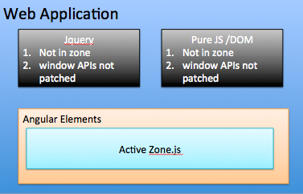

# AngularElements

A POC of `Angular Elements` with `zone.js`.

In ng-conf 2018, robwormald described the use cases of `Angular Elements`.

1.  If the `Angular Elements` is used inside an Angular application, then `zone.js` is already loaded, so user can develop the `Angular Elements` in normal way.

    * Pro: User can develop `Angular Element` just like they develop normal `Angular Component`, and user can easily expose a lot of existing `Angular Component` to `Angular Element`.
    * Con: In this case, there is a limitation that the `Angular Element` need to run in a `Angular App Host`.

2.  If the `Angular Elements` is used inside an non-angular application, such as inside a web app which developed with pure js or jquery or react, then we should not use `zone.js`, because `zone.js` will monkey-patch a lot of `global/window` APIs such as `setTimeout/Promise`, so using `zone.js` will impact the APIs outside of `Angular Elements`. Instead, we use `noop zone`.
    * Pro: Don't need to worry about `zone.js`, no Window API will be patched, and the bundle size is smaller (`zone.js` will be 12k).
    * Con: User need to take care of `Change Detection` themselves, and existing `Angular Component` will not be easily exported as `Angular Element` in this way.

**So my idea is add a `3rd option`.**

3.  if there is a way to let `zone.js` only patch `global/window` APIs when we `enter Angular Elements` and `restore the original delegate` when we `exit Angular Elements`. We can develop `Angular Elements with zone.js` without impact outside world.
    * Pro: Still has `ngZone`, user can still develop `Angular Element` just like developing normal `Angular Component`. And of course, the existing `Angular Component` can easily be exported as `Angular Element`. And user don't need to worry about `zone.js` will impact other parts of the webapp which are outside of `Angular Element`.
    * Con: User still need to load `zone.js`, which will be `12k` bundle.

This is the overview 

## How it works

1.  First import `zone.js/dist/zone.js` will not monkey-patch anything until `Zone.__init__()` is called.
2.  Call `Zone.__init__()` before bootstrap `Angular Elements`.
3.  After `BootStrap`, restore all monkey-patched APIs to `native` one.

```javascript
try {
  Zone.__init__(); // monkey patch window APIs
  platformBrowserDynamic()
    .bootstrapModule(AppModule)
    .then(ref => {
      // Ensure Angular destroys itself on hot reloads.
      if (window['ngRef']) {
        window['ngRef'].destroy();
      }
      window['ngRef'] = ref;

      // Otherise, log the boot error
    })
    .catch(err => console.error(err));
} finally {
  Zone.__unloadAll_patch(); // detach the monkey patch, so all window APIs was restored to native one.
}
```

4.  Inside `zone.run()/zone.runGuarded()`, `reload all patches` before run and `unload all patches` after run.

**So monkey patched version of window API only exists inside Angular Elements**

Here is the demo link [DEMO](https://github-zmawnz.stackblitz.io).

In the demo, there is an angular Element with zone.js, and it will run inside of `angular` zone, and outside there is a button `Click outside of Angular Element`, click the button will check eventHandler/setTimeout/Promise is monkey patched or not, and print error stack traces to verify no zone related stack frames are inside.
